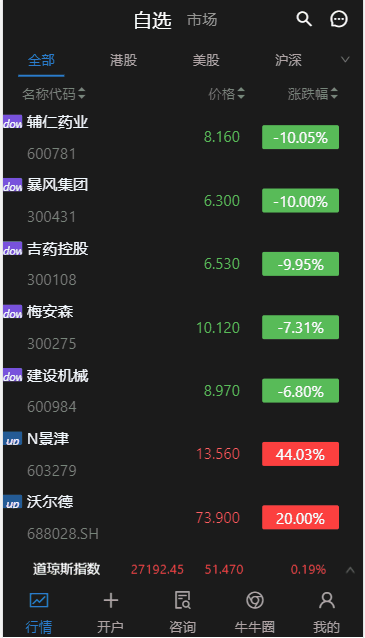

# 前言

React的项目模拟

## 项目名称

富途牛牛APP

## 技术栈

React+create-react-app+React-router+React-redux+antd+@antv/f2+scss+webpack+axios+ES6/7

## 项目运行

### 注意：由于涉及大量的ES6/7等新属性，node需要6.0以上的版本

```
    git clone https://github.com/gzh51904/Futuniuniu/

    cd ftnn

    npm install 或yarn

    npm start
```

## 链接

- [富途牛牛官网/我们仿的是APP](https://www.futunn.com/)

- [我们的APP](###)

## 部分截图

### 主页



## 项目目标

- [x] 股市的实时更新 -- 完成
- [x] 股市趋势的折线图展示 -- 完成
- [ ] 股市统计圆盘展示 -- 未完成

## 项目职责

- 项目分配
  - 组长:梁唯汉
    - 主页股市的实时监听
    - 实现主页功能的大部分
    - 一些股市数据的图表展示
    - 服务器的代理
  - 组员:刘俊
    - 牛牛圈的功能大部分的实现
  - 组员:吴广军
    - 咨询的功能大部分的实现
  - 组员:沈卓
    - 我的的功能大部分的实现
    - 登陆注册的实现

## 贡献者

<table><tbody><tr>
<td>
   <a href="https://github.com/liangliangMirror" title="liangliangMirror">  </a></td>
   <td><a href="https://github.com/tree-file" title="tree-file"> </a></td>
  <td> <a href="https://github.com/MaxinFN/" title="MaxinFN">  </a></td>
  <td> <a href="https://github.com/git-shenzhuo" title="shenzhuo">  </a></td>
<tr></tbody></table> 
